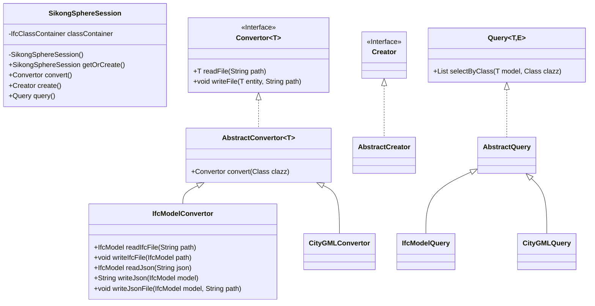

# SikongSphere-IfcTools Document

## 1. 项目概述

SikongSphere-ifctools旨在构建基于工业基础类（Industry Foundation Class，简称IFC）标准的建筑信息模型开源生态。它关注如何对IFC标准进行实现和功能接口的扩展，扮演了核心工具库的角色，而非某一种具体数据产品。

标准、多样性、业务友好性是SikongSphere-ifctools的核心理念。

- 标准：作为建筑行业内BIM标准的参编单位，SikongSphere将遵循行业标准来进行代码实现。同样，sikongsphere-ifctools作为Sikongsphere的核心工具库，也会严格遵循国际标准，兼容现有的技术生态。
- 多样性：本项目提供了大量的接口，其中会支持例如文件解析、文件格式转换、建筑模型生成、数据模型的序列化反序列化、压缩解压以及加密等多种功能，涵盖了数据产品需要用到的方方面面的功能。
- 业务友好性：本项目的功能接口在设计时，在设计思想层面上，会兼容装配式建筑的建筑和管理模式，而不是完全照搬现有的纯软件设计的思路。一方面会方便用户理解其中逻辑，另一方面也会优化BIM数据管理逻辑。

## 2. 快速上手

用户如果使用的是Maven，则需要在pom.xml文件下，添加如下的依赖信息。

```xml
<dependency>
    <groupId>org.sikongsphere</groupId>
    <artifactId>sikongsphere-ifctools</artifactId>
    <version>0.2.0-beta</version>
</dependency>
```

用户如果使用的是Gradle，则需要在Gradle文件中，添加如下的依赖信息。

```shell
implementation group: 'org.sikongsphere', name: 'sikongsphere-ifctools', version: '0.2.0-beta'
```

在具体的使用过程中，对文件格式转换的使用需求是比较高的，因此我们给出如下的代码示例。

```java
import org.sikongsphere.ifc.model.fileelement.IfcFileModel;
import org.sikongsphere.ifc.sdk.SikongSphereSession;
import org.sikongsphere.ifc.sdk.convert.IfcModelConvertor;

public class SikongSphereDemo {
    
    public static void main(String[] args) {
        // 构建SikongSphereSession对象
        SikongSphereSession sikongSphereSession = SikongSphereSession.getOrCreate();
        // 获取转换器
        IfcModelConvertor convertor = (IfcModelConvertor) sikongSphereSession.convertor(
                IfcFileModel.class
        );

        // 输入文件路径
        String input = "";
        // 输出文件路径
        String output = "";

        // 读取文件
        IfcFileModel model = convertor.readFile(input);
        // 写出文件
        convertor.writeFile(model, output);
    }
}
```

首先我们构建一个SikongSphereSession对象，这是SikongSphere-IfcTools的总入口。它内部包含了一些环境信息，以及一些预加载的内容。

接着，我们利用这个SikongSphereSession对象，获取到对应模型类的转换器。

最后，我们就使用这个转换器完成文件的读入和输出。

## 3. 特性

目前SikongSphere-IfcTools已经实现如下特性：

- Ifc 2.3版本标准的模型实现
- Ifc文件的内容解析功能
- Ifc文件的读入和写出功能
- IfcJSON文件的读入和写出功能
- Ifc文件和IfcJSON文件的格式互转功能

还有一些实验特性：

- 基于Ifc标准的API
  - 用于构建的Creator
  - 用于查询的Query
  - 用于分析的Analyer
  - 用于数据格式转换的Convertor
- 基于Ifc标准的Graph API

## 4. 用户手册

### 4.1. 框架

整体SDK的框架如下。



其中，SikongSphereSession是最重要的类，它内部封装了很多预定义信息，为了减少这些预定义信息的重复出现，我们使用了单例模式，用户直接调用`getOrCreate`函数就可以获取到它的实例。

在SikongSphereSession中，包含了几个函数，用户可以利用这几个函数获取到对应的功能对象。

用户可以调用convertor函数，获取到针对性的转换对象。

```java
public AbstractConvertor<?> convertor(Class<?> clazz)
```

用户可以调用query函数，获取到针对性的查询对象。

```
public AbstractQuery<?> query(Class<?> clazz)
```


## 5. FAQ

